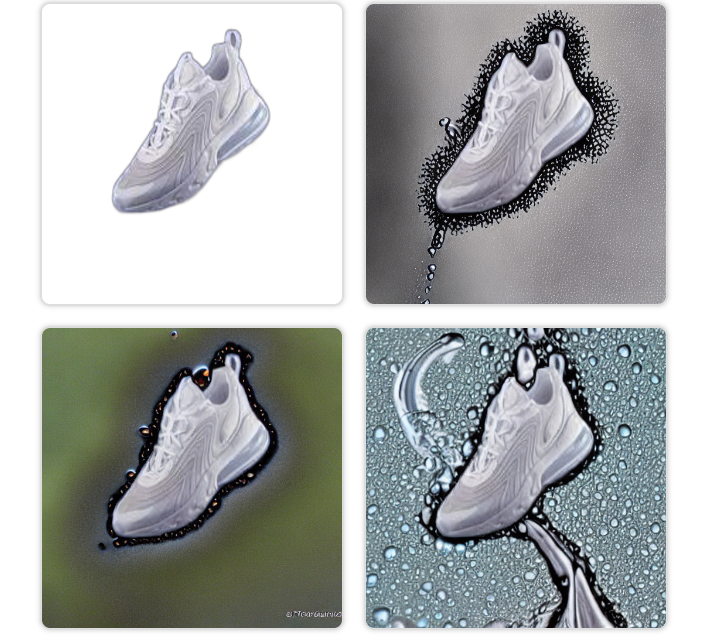
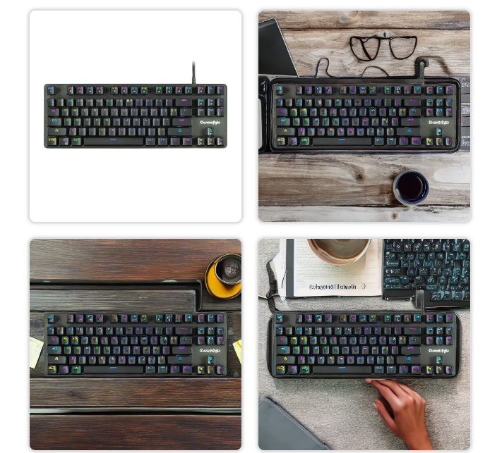

# BgChanger

BgChanger is a project that leverages advanced AI models to remove and replace backgrounds in images. It combines background removal using DIS and inpainting with Stable Diffusion.

## Project Structure

BgChanger
├── BgChanger.ipynb
├── BgRemover
│ ├── basics.py
│ ├── bg_remover.py
│ ├── data_loader_cache.py
│ ├── hce_metric_main.py
│ ├── Inference.py
│ ├── models
│ │ ├── init.py
│ │ ├── isnet.py
│ │ └── pycache
│ │ ├── init.cpython-37.pyc
│ │ └── u2netfast.cpython-37.pyc
│ ├── pycache
│ │ ├── basics.cpython-37.pyc
│ │ ├── bg_remover.cpython-310.pyc
│ │ ├── data_loader_cache.cpython-310.pyc
│ │ └── data_loader_cache.cpython-37.pyc
│ ├── pytorch18.yml
│ ├── requirements.txt
│ └── train_valid_inference_main.py
├── BgReplacer
│ └── StableDiffusionInPaint.py
├── FrontEnd
│ ├── static
│ │ ├── css
│ │ │ └── style.css
│ │ └── js
│ │ └── script.js
│ └── templates
│ └── index.html
├── keyboard_result.png
├── main.py
├── README.md
├── shoe_result.png
├── test_image.jpeg
└── uploaded_image.png

## Background Removal (BgRemover)

BgRemover uses the DIS model to remove backgrounds from images.

Repository: [DIS Background Remover](https://github.com/xuebinqin/DIS)

## Background Replacement (BgReplacer)

BgReplacer employs Stable Diffusion Inpainting to replace backgrounds in images.

Repository: [Stable Diffusion Inpainting](https://huggingface.co/runwayml/stable-diffusion-inpainting)

## Results

Examples of background removal and replacement:
- 
- 

## How to Use

1. Clone the repository.
2. Install the required dependencies using `requirements.txt`.
3. Run `main.py` to start the application.

git clone <repository_url>
cd BgChanger
pip install -r requirements.txt
python main.py